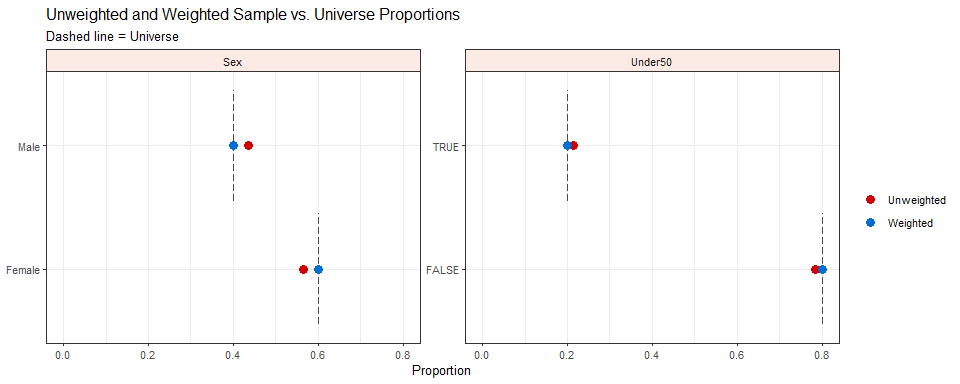

# iterake 

## Overview

iterake’s main utility is creating row weights using a process called
iterative raking. Iterative raking (also known as rim weighting), is one
of several methods used to correct the deviation between the *marginal*
proportions in a sample and a known population, or, universe as it was
first referred to (Deming & Stephan 1940) for a given set of variables.

iterake is designed with speed and simplicity in mind. The weighting
algorithm is powered by
[data.table](https://github.com/Rdatatable/data.table/wiki) and takes
advantage of its fast
[grouping](https://github.com/Rdatatable/data.table/wiki/Benchmarks-:-Grouping)
and joining.

## Workflow

The weighting process with `iterake` is fairly straightforward, we
suggest:

1.  Use the `universe()` function to build your population.
    1.  The univerise is constructed with one or more categories where
        the marginal probabilites are known. These categories are built
        with the `category()` function.
    2.  If you want to use the natural marginal proportions from an
        existing dataset as your targets, you can use
        `inherit_category()`. Just make sure the name given to the
        category matches the existing data and the data you intend to
        weight.
2.  Compare the marginal proportions in your sample with the population
    with `compare_margins()` function.  
3.  If needed, create weights for your data using `iterake()`.  
4.  Use `compare_margins()` again to verify that the weighted
    proportions in your sample now match the population.  
5.  Check the performance of the weighting model with `weight_stats()`.

## Installation

``` r
# Install the development version from GitHub
install.packages("remotes")
remotes::install_github("ttrodrigz/iterake")
```

## Motivating Example

Say you have conducted a study by randomly sampling 400 individuals from
a population. You were dilligent in monitoring the responses to make
sure the makeup of the sample adequately reflected the population. But,
due to chance, slightly too many males and individuals under 50 years of
age entered the sample.

You know from experts in your field that 60% of the population from
which you sampled are female, and 20% of the population are less than 50
years old. Let’s build a data set to use as an example:

``` r
library(tibble)

N <- 400

set.seed(101)

df <- tibble(
  id = 1:N,
  Sex = sample(
    x = c("Male", "Female"),
    size = N,
    replace = TRUE,
    prob = c(0.42, 0.58)
  ),
  Under50 = sample(
    x = c(T, F),
    size = N,
    replace = TRUE,
    prob = c(0.22, 0.78)
  )
  
)

df
#> # A tibble: 400 x 3
#>       id Sex    Under50
#>    <int> <chr>  <lgl>  
#>  1     1 Female FALSE  
#>  2     2 Female TRUE   
#>  3     3 Male   FALSE  
#>  4     4 Male   TRUE   
#>  5     5 Female FALSE  
#>  6     6 Female TRUE   
#>  7     7 Male   FALSE  
#>  8     8 Female TRUE   
#>  9     9 Male   TRUE   
#> 10    10 Female FALSE  
#> # ... with 390 more rows
```

#### **Step 1:** Build the universe

Simply supply the data you intend on weighting, and build weighting
categories by using the `category()` function.

``` r
library(iterake)

uni <- universe(
  
  data = df,
  
  category(
    name = "Sex",
    buckets = c("Male", "Female"),
    targets = c(0.4, 0.6)
  ),
  
  category(
    name = "Under50",
    buckets = c(TRUE, FALSE),
    targets = c(0.2, 0.8)
  )
  
)
```

#### **Step 2:** Compare marginal proportions prior to weighting

This is the time to inspect the differences in proportions between the
sample and the population. A large discrepancy will require extreme
weights, and in some cases the algorithm may not even converge. Before
you decide to weight, keep in mind that weighting the data decreases
accuracy. In some cases it is best to deal with the fact your sample
doesn’t perfectly match the population.

``` r
compare_margins(df = df, universe = uni)
#>    bucket uwgt_n uwgt_prop targ_prop uwgt_diff category
#> 1:   Male    174     0.435       0.4     0.035      Sex
#> 2: Female    226     0.565       0.6    -0.035      Sex
#> 3:   TRUE     86     0.215       0.2     0.015  Under50
#> 4:  FALSE    314     0.785       0.8    -0.015  Under50
```

#### **Step 3:** Weight the data

If weighting is necessary, pass the universe object to `iterake()`.

``` r
df_wgt <- iterake(universe = uni)
#> 
#> -- iterake summary -------------------------------------------------------------
#>  Convergence: Success
#>   Iterations: 4
#> 
#> Unweighted N: 400.00
#>  Effective N: 397.57
#>   Weighted N: 400.00
#>   Efficiency: 99.4%
#>         Loss: 0.006

df_wgt
#> # A tibble: 400 x 4
#>       id Sex    Under50 weight
#>    <int> <chr>  <lgl>    <dbl>
#>  1     1 Female FALSE    1.08 
#>  2     2 Female TRUE     0.992
#>  3     3 Male   FALSE    0.937
#>  4     4 Male   TRUE     0.862
#>  5     5 Female FALSE    1.08 
#>  6     6 Female TRUE     0.992
#>  7     7 Male   FALSE    0.937
#>  8     8 Female TRUE     0.992
#>  9     9 Male   TRUE     0.862
#> 10    10 Female FALSE    1.08 
#> # ... with 390 more rows
```

#### **Step 4:** Compare marginal proportions after weighting

``` r
library(dplyr)
# re-inspect proportions with plot
compare_margins(
    df = df_wgt, 
    weight = weight, 
    universe = uni,
    plot = TRUE
)
```

<!-- -->

    #>    bucket uwgt_n wgt_n uwgt_prop wgt_prop targ_prop uwgt_diff
    #> 1:   Male    174   160     0.435      0.4       0.4     0.035
    #> 2: Female    226   240     0.565      0.6       0.6    -0.035
    #> 3:   TRUE     86    80     0.215      0.2       0.2     0.015
    #> 4:  FALSE    314   320     0.785      0.8       0.8    -0.015
    #>         wgt_diff category
    #> 1: -4.279743e-12      Sex
    #> 2:  4.279688e-12      Sex
    #> 3:  2.775558e-16  Under50
    #> 4: -3.330669e-16  Under50

#### **Step 5:** Inspect weights

Again, weights much higher or lower than 1 are undesirable, check the
output with `weight_stats()` to inspect the quality of the weights.
Details about what each of the statistics mean can be found in the
documentation.

``` r
weight_stats(df_wgt[["weight"]])
#> # A tibble: 1 x 7
#>   uwgt_n wgt_n eff_n    loss efficiency min_wgt max_wgt
#>    <int> <dbl> <dbl>   <dbl>      <dbl>   <dbl>   <dbl>
#> 1    400  400.  398. 0.00611      0.994   0.862    1.08
```
