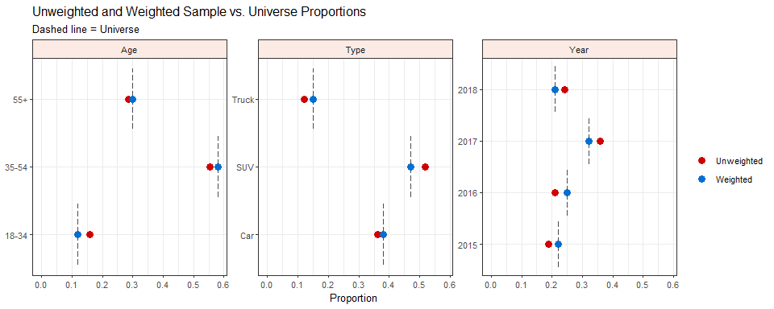

iterake 
===============================================================================

Overview
--------

iterake's main utility is creating row-level weights using a process called iterative raking. Iterative raking (also known as rim weighting), is one of several methods used to correct the deviation between the *marginal* proportions in a sample and a known population, or, universe as it was first referred to (Deming & Stephan 1940) for a given set of variables.

iterake is designed with speed and simplicity in mind. The weighting algorithm is powered by [data.table](https://github.com/Rdatatable/data.table/wiki) and takes advantage of its fast [grouping](https://github.com/Rdatatable/data.table/wiki/Benchmarks-:-Grouping) and joining; it tends to scale well even with larger data sets. The functions of this package are designed to play nicely with users of the [tidyverse](https://github.com/tidyverse/tidyverse). Columns in the data can be accessed without quotation, and every function returns a [tibble](https://github.com/tidyverse/tibble).

Workflow
--------

The weighting process with `iterake` is fairly straightforward, we suggest:

1.  Use the `universe()` function to build your population.
    1.  The univerise is constructed with one or more categories where the marginal probabilites are known. These categories are built with the `category()` function.
    2.  If you want to use the natural marginal proportions from an existing dataset as your targets, you can use `inherit_category()`. Just make sure the name given to the category matches the existing data and the data you intend to weight.
2.  Compare the marginal proportions in your sample with the population with `compare_margins()` function.
3.  If needed, create weights for your data using `iterake()`.
4.  Use `compare_margins()` again to verify that the weighted proportions in your sample now match the population.
5.  Check the performance of the weighting model with `weight_stats()`.

Installation
------------

``` r
# Install the development version from GitHub
install.packages("devtools")
devtools::install_github("ttrodrigz/iterake")
```

Motivating Example
------------------

Suppose a car dealership is interested in surveying the opinions of people who purchased a new vehicle from their lot. This dealership has been around since 2015 and has kept accurate records of its sales since its inception. The dealership randomly samples 400 individuals from its sales database to complete a customer satisfaction survey.

The dealership wants to make sure their sample is representative of the population, so they calculate the marginal proportions of a few key categories:

<table class="kable_wrapper">
<tbody>
<tr>
<td>
<table>
<thead>
<tr>
<th style="text-align:center;">
Age
</th>
<th style="text-align:center;">
Pop.
</th>
<th style="text-align:center;">
Sample
</th>
</tr>
</thead>
<tbody>
<tr>
<td style="text-align:center;">
18-34
</td>
<td style="text-align:center;">
12%
</td>
<td style="text-align:center;">
16%
</td>
</tr>
<tr>
<td style="text-align:center;">
35-54
</td>
<td style="text-align:center;">
58%
</td>
<td style="text-align:center;">
55.5%
</td>
</tr>
<tr>
<td style="text-align:center;">
55+
</td>
<td style="text-align:center;">
30%
</td>
<td style="text-align:center;">
28.5%
</td>
</tr>
</tbody>
</table>
</td>
<td>
<table>
<thead>
<tr>
<th style="text-align:center;">
Year
</th>
<th style="text-align:center;">
Pop.
</th>
<th style="text-align:center;">
Sample
</th>
</tr>
</thead>
<tbody>
<tr>
<td style="text-align:center;">
2015
</td>
<td style="text-align:center;">
22%
</td>
<td style="text-align:center;">
19%
</td>
</tr>
<tr>
<td style="text-align:center;">
2016
</td>
<td style="text-align:center;">
25%
</td>
<td style="text-align:center;">
21%
</td>
</tr>
<tr>
<td style="text-align:center;">
2017
</td>
<td style="text-align:center;">
32%
</td>
<td style="text-align:center;">
36%
</td>
</tr>
<tr>
<td style="text-align:center;">
2018
</td>
<td style="text-align:center;">
21%
</td>
<td style="text-align:center;">
24%
</td>
</tr>
</tbody>
</table>
</td>
<td>
<table>
<thead>
<tr>
<th style="text-align:center;">
Type
</th>
<th style="text-align:center;">
Pop.
</th>
<th style="text-align:center;">
Sample
</th>
</tr>
</thead>
<tbody>
<tr>
<td style="text-align:center;">
Car
</td>
<td style="text-align:center;">
38%
</td>
<td style="text-align:center;">
36%
</td>
</tr>
<tr>
<td style="text-align:center;">
SUV
</td>
<td style="text-align:center;">
47%
</td>
<td style="text-align:center;">
52%
</td>
</tr>
<tr>
<td style="text-align:center;">
Truck
</td>
<td style="text-align:center;">
15%
</td>
<td style="text-align:center;">
12%
</td>
</tr>
</tbody>
</table>
</td>
</tr>
</tbody>
</table>
There are slight deviations between what was collected in the sample and the known population. These deviations are small enough where weighting can be performed to correct for these differences between the marginal proportions.

#### **Step 1**: Build the universe with known marginal proportions based on categories of interest.

``` r
# data comes pre-packaged with iterake
library(iterake)
data("dealer_data")

# build the 'universe'
dealer_uni <- universe(
    
    df = dealer_data,
    
    category(
        name = "Age",
        buckets = c("18-34", "35-54", "55+"),
        targets = c(.12, .58, .30)
    ),
    
    category(
        name = "Year",
        buckets = c(2015, 2016, 2017, 2018),
        targets = c(.22, .25, .32, .21)
    ),
    
    category(
        name = "Type",
        buckets = c("Car", "SUV", "Truck"),
        targets = c(.38, .47, .15)
    )
    
)
```

#### **Step 2**: Compare *unweighted* sample proportions to the universe.

``` r
compare_margins(dealer_data, universe = dealer_uni)
#> # A tibble: 10 x 6
#>    category bucket uwgt_n uwgt_prop targ_prop uwgt_diff
#>    <chr>    <chr>   <int>     <dbl>     <dbl>     <dbl>
#>  1 Age      18-34      64     0.16      0.12     0.04  
#>  2 Age      35-54     222     0.555     0.580   -0.0250
#>  3 Age      55+       114     0.285     0.3     -0.015 
#>  4 Year     2015       76     0.19      0.22    -0.03  
#>  5 Year     2016       84     0.21      0.25    -0.04  
#>  6 Year     2017      143     0.358     0.32     0.0375
#>  7 Year     2018       97     0.242     0.21     0.0325
#>  8 Type     Car       145     0.362     0.38    -0.0175
#>  9 Type     SUV       207     0.518     0.47     0.0475
#> 10 Type     Truck      48     0.12      0.15    -0.03
```

#### **Step 3**: Weight the data.

``` r
dealer_weighted <- iterake(dealer_data, dealer_uni)
#> 
#> -- iterake summary -------------------------------------------------------------
#>  Convergence: Success
#>   Iterations: 13
#> 
#> Unweighted N: 400.00
#>  Effective N: 381.09
#>   Weighted N: 400.00
#>   Efficiency: 95.3%
#>         Loss: 0.05

dealer_weighted
#> # A tibble: 400 x 5
#>    Sales_ID Age    Year Type  weight
#>       <int> <chr> <dbl> <chr>  <dbl>
#>  1     4349 35-54  2016 SUV    1.15 
#>  2     1394 55+    2017 Car    1.01 
#>  3     7385 35-54  2017 SUV    0.841
#>  4     6917 18-34  2017 Car    0.694
#>  5     3247 55+    2017 SUV    0.862
#>  6     3698 18-34  2017 SUV    0.594
#>  7     6260 35-54  2018 SUV    0.792
#>  8     3998 55+    2015 Car    1.31 
#>  9     6593 18-34  2016 SUV    0.812
#> 10     5907 35-54  2017 Car    0.982
#> # ... with 390 more rows
```

#### **Step 4**: Compare *weighted* sample proportions to the universe.

``` r
library(dplyr)

# re-inspect proportions with plot
compare_margins(
    df = dealer_weighted, 
    weight = weight, 
    universe = dealer_uni,
    plot = TRUE
) %>%
    select(-contains("uwgt"))
```



    #> # A tibble: 10 x 6
    #>    category bucket wgt_n wgt_prop targ_prop wgt_diff
    #>    <chr>    <chr>  <dbl>    <dbl>     <dbl>    <dbl>
    #>  1 Age      18-34    48     0.12      0.12         0
    #>  2 Age      35-54   232     0.580     0.580        0
    #>  3 Age      55+     120.    0.3       0.3          0
    #>  4 Year     2015     88     0.22      0.22         0
    #>  5 Year     2016    100     0.25      0.25         0
    #>  6 Year     2017    128     0.32      0.32         0
    #>  7 Year     2018     84     0.21      0.21         0
    #>  8 Type     Car     152     0.38      0.38         0
    #>  9 Type     SUV     188     0.47      0.47         0
    #> 10 Type     Truck    60     0.15      0.15         0

#### **Step 5**: Inspect performance of weighting model.

``` r
# want to make sure weighting model is efficient 
# and there aren't any extreme weights

weight_stats(dealer_weighted$weight)
#> # A tibble: 1 x 7
#>   uwgt_n wgt_n eff_n   loss efficiency min_wgt max_wgt
#>    <int> <dbl> <dbl>  <dbl>      <dbl>   <dbl>   <dbl>
#> 1    400   400  381. 0.0496      0.953   0.559    1.64
```

Final Notes
-----------

-   A big **THANK YOU** goes out to our friend James Bouchey for designing the `iterake` hex logo. Please check out his [portfolio](https://jamesbouchey.myportfolio.com/) as his talents extend far past making super clever package logos.
-   We are currently preparing to submit iterake to CRAN, so any feedback is well-received.
-   Stay tuned for a [pkgdown](https://github.com/r-lib/pkgdown) site for this package with more details on how, why, and when to use iterake.
